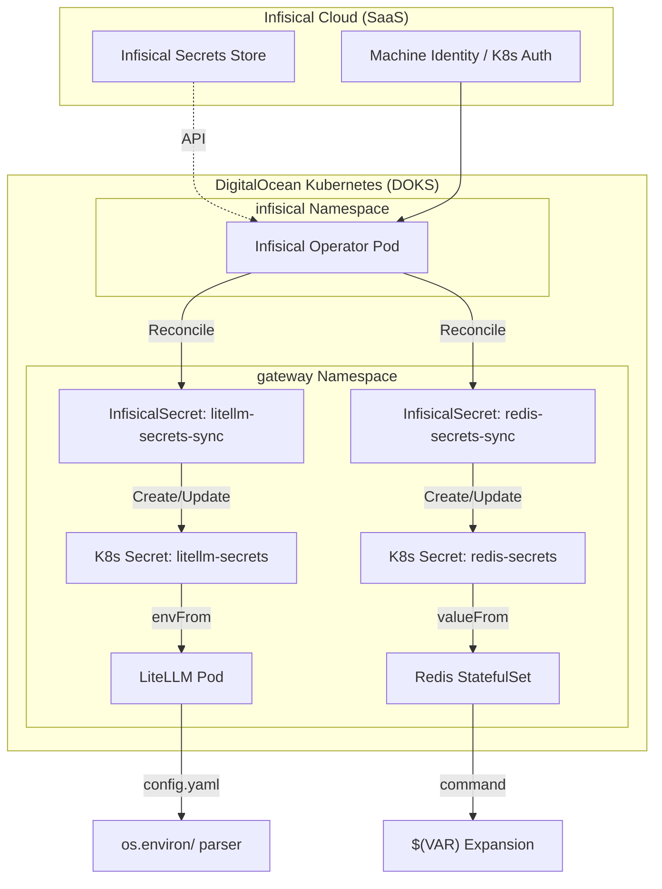

# Secret Management & Environment Injection

| Field | Value |
|---|---|
| **Phase** | Phase 1 🔴 |
| **Status** | ✅ Documented |
| **Owner** | @RMN @LDC |
| **Last Updated** | 2026-03-13 |

This document defines the technical architecture for securely syncing, injecting, and consuming secrets across the jAIMSnet ecosystem using **Infisical**, the **Infisical Kubernetes Operator**, and native Kubernetes primitives.

---

## Architecture Overview

jAIMSnet follows a "SecretOps" pattern where Infisical Cloud serves as the single source of truth. Secrets are dynamically synced into Kubernetes and injected into container environments.



---

## 1. Infisical to Kubernetes Sync

Direct manual creation of Kubernetes Secrets is forbidden. All secrets are managed via the `InfisicalSecret` Custom Resource Definition (CRD).

### Reconciliation Flow
1. **Operator Auth**: The Infisical Operator authenticates with Infisical Cloud using a **Machine Identity** tied to the cluster's Service Account.
2. **CRD Watching**: The operator watches for `InfisicalSecret` resources in the cluster.
3. **Secret Materialization**: For every CRD, the operator pulls keys from the specified `projectId` and `envSlug` and creates a native `v1/Secret` object in the same namespace.

---

## 2. Environment Injection (Kubernetes Layer)

Secrets are injected into containers at the **Pod level** using two methods:

### Method A: Global Injection (`envFrom`)
Used by **LiteLLM** and **Langfuse** to load many keys efficiently.
```yaml
envFrom:
  - secretRef:
      name: litellm-secrets
```
* **Result**: Every key-value pair in the Secret becomes an environment variable inside the container.

### Method B: Selective Mapping (`valueFrom`)
Used by **Redis** for specific sensitive variables.
```yaml
env:
  - name: REDIS_PASSWORD
    valueFrom:
      secretKeyRef:
        name: redis-secrets
        key: REDIS_PASSWORD
```

---

## 3. Application Consumption Patterns

### LiteLLM (`os.environ/`)
LiteLLM provides a custom syntax in `config.yaml` to prevent hardcoding sensitive tokens in ConfigMaps.

* **Usage**: `master_key: "os.environ/LITELLM_MASTER_KEY"`
* **Mechanism**:
    1. LiteLLM starts and reads the ConfigMap file.
    2. The parser detects the `os.environ/` prefix.
    3. It performs a lookup against the OS environment variables (injected by K8s in Step 2).
    4. The value is replaced **in-memory** during configuration initialization.

### Redis (`$(VAR)` Expansion)
Redis requires a password at the command-line level via the `--requirepass` flag.

* **Usage**: `command: ["redis-server", "--requirepass", "$(REDIS_PASSWORD)"]`
* **Mechanism**:
    1. Kubernetes Kubelet evaluates the Pod spec.
    2. It detects the `$(VAR)` syntax in the `command` or `args` array.
    3. It looks up the variable from the `env` list defined in the container spec.
    4. The shell-like expansion happens **before** the process starts, ensuring Redis receives the plaintext password securely.

---

## Security Best Practices
- **Auto-Reload**: Deployments are annotated with `secrets.infisical.com/auto-reload: "true"` to trigger rolling restarts when secrets are rotated in Infisical.
- **Non-Root**: All containers run as non-root users (UID 1000/999) to prevent secret extraction via path traversal.
- **No Persistence**: Kubernetes Secrets are stored in `tmpfs` (RAM) on the worker nodes, minimizing data-at-rest risks.
